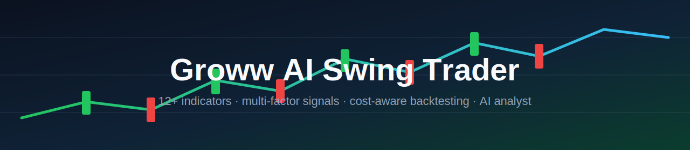
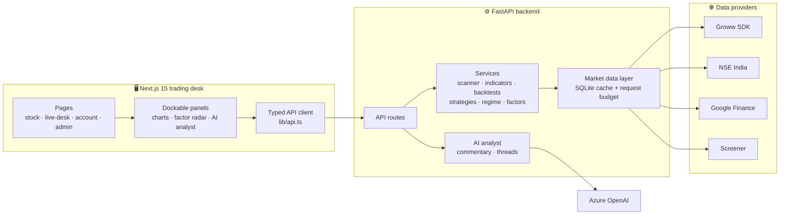

<p align="center">
  
</p>

<p align="center">
  <a href="https://github.com/lalitofficial/groww-trader/actions/workflows/ci.yml"></a>
  <a href="LICENSE"></a>
  
  
  
  
</p>

**Groww AI Swing Trader** is a full-stack, read-only swing-trading analysis platform for the Indian markets: a FastAPI backend that scans, scores, and backtests NSE symbols through the Groww API, and a Next.js trading desk that turns the output into decisions — charts, factor radars, catalyst timelines, risk planning, and an Azure OpenAI analyst you can interrogate.

> **Read-only by design.** The platform analyses live account and market data but exposes no order placement, modification, or cancellation — it is an analysis copilot, not an execution bot.

## Highlights

- **12+ technical indicators** — RSI, MACD, EMA, SMA, VWAP, ATR, Bollinger Bands, Supertrend, Donchian & Keltner channels, Stochastic, and momentum — computed via `pandas-ta` with dependency-free fallbacks, plus candlestick pattern detection.
- **Multi-factor long/short signal engine** — alpha factors, market-regime detection, and a strategy library with a declarative spec format (strategies can even be imported from GitHub) feed a multi-factor scanner that ranks long and short candidates.
- **Transaction-cost-aware backtesting** — realistic brokerage, STT, and slippage assumptions (all configurable) with **Sharpe ratio, maximum drawdown, profit factor, and win rate** reported per run, and paper trading to forward-test signals.
- **Multi-provider market data** — Groww SDK first with NSE India, Google Finance, and Screener fallbacks, cached in SQLite with per-class TTLs and a request budget so free-tier API limits survive a full scan.
- **AI analyst mode** — Azure OpenAI summaries, threaded Q&A, and streaming commentary grounded in the platform's own indicator, factor, and catalyst context.
- **Catalysts & sentiment** — earnings calendar, news catalyst ingestion, sentiment scoring, watchlists, and Telegram alert delivery.
- **Live trading desk** — a dockable Next.js 15 dashboard (dockview + lightweight-charts) with stock analyzer, account cockpit (holdings, positions, orders, margin, risk cards), live price streams, and an admin panel with health metrics, feature flags, and audit logs.

## Architecture



- **`src/groww_trader/`** — Python package: Groww client, CLI, and ~35 service modules (indicators, patterns, scanner, strategies, backtests, paper trades, catalysts, sentiment, alerts, admin, AI).
- **`app/` + `components/`** — Next.js App Router pages and 50+ React panels for the trading desk.
- **`lib/` + `hooks/`** — typed API client, AI tool context, and live-stream React hooks.
- **`tests/`** — pytest suites for indicators, strategies, analytics, market data, and session/AI gating, plus vitest for the web client.

## Getting started

### Prerequisites

- Python ≥ 3.9 and Node.js ≥ 20
- A [Groww trading API](https://groww.in/trade-api) key (or TOTP credentials)
- Optional: an Azure OpenAI deployment for analyst mode, a Telegram bot for alerts

### Setup

```bash
# 1. Backend
python3 -m venv .venv && source .venv/bin/activate
pip install -e .

# 2. Frontend
npm install

# 3. Configure
cp .env.example .env   # fill in Groww credentials (+ optional Azure OpenAI / Telegram)

# 4. Run everything (FastAPI on :8000, Next.js on :3000)
groww-trader dashboard
```

### CLI

```bash
groww-trader profile
groww-trader quote RELIANCE --exchange NSE --segment CASH
groww-trader candles RELIANCE --start-time "2026-05-20 09:15:00" --end-time "2026-05-20 15:30:00" --interval 5
groww-trader dashboard --api-only
```

## Testing

```bash
pytest      # backend: indicators, strategies, analytics, market data, AI gating
npm test    # web client (vitest)
npm run lint
```

CI runs both suites plus ESLint on every push and pull request.

## Disclaimer

This project is for research and education. It is **not** investment advice, and it deliberately cannot place orders. Trade at your own risk.

## License

[MIT](LICENSE) © Lalit Kumar
